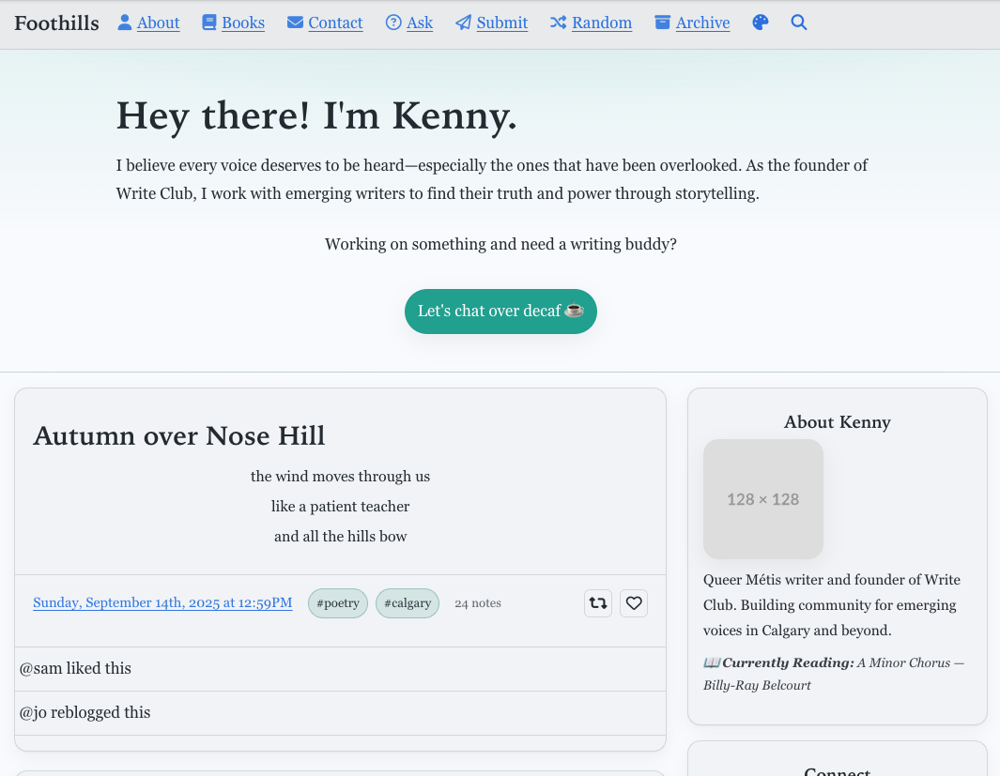

<!-- PROJECT LOGO -->
 

  

  <h3 align="center">Foothills — Tumblr Theme for Poetry & Community</h3>

  

    A warm, accessible Tumblr theme for writers and community builders.
     
    <a href="docs/GUIDE.md"><strong>Explore the docs »</strong></a>
     
     
    <strong><a href="https://foothills-tumblr.netlify.app/preview/">View Demo</a></strong>
    ·
    <a href="https://github.com/brennanbrown/foothills/issues">Report Bug</a>
    ·
    <a href="https://github.com/brennanbrown/foothills/issues">Request Feature</a>
  

<!-- BADGES -->

  

 
 

 

 
 

This repo contains:
- `theme/foothills.html` — the complete single‑file Tumblr theme for Tumblr’s Custom HTML editor.
- `assets/foothills.css` — optional external stylesheet you can host and reference in Theme Options.
- `docs/` — documentation and change history (`GUIDE.md`, `CHANGELOG.md`).
 - Optional demo hosting via Netlify.

## Features

- Mobile drawer with centered title, separators, palette toggle, and italic blurb
- Theme palette system (Prairie, River, Night, Burnt) with one‑click cycling and persistence
- SEO in head: canonical, Open Graph, Twitter Cards, theme‑color, optional JSON‑LD
- Pinned post styling with accent top bar and `pinned-badge`
- First‑class reblog trail support for NPF and legacy posts
- Poetry formatting for originals and via tag detection (#poetry/#poem)
- Sidebar widgets: About (with “Currently Reading”), Social grid, Substack, Blogroll, Donate
- Accessibility basics: skip link, landmarks, keyboard‑friendly overlays

## Quick Start

1) Open Tumblr → Customize → Edit HTML.
2) Paste the entire contents of `theme/foothills.html`.
3) Save and exit HTML editor.
4) In Customize → Theme Options, set:
   - Colors, fonts, palette
   - Nav links, Social URLs (full URLs), Write Club description, Calendly link
   - Toggles (poetry formatting, hero CTA, Use Chota CSS, Donate)
   - Optional: set `External Stylesheet URL` to your hosted `assets/foothills.css`

## External Stylesheet Options

There are two supported ways to host `assets/foothills.css`:

- GitHub Raw (good for development and personal use)
  - Example URL: `https://raw.githubusercontent.com/brennanbrown/foothills/MAIN_OR_TAG/assets/foothills.css`
  - Replace `MAIN_OR_TAG` with your default branch (e.g., `main`) or a version tag.

- Tumblr Static Assets (required for Theme Garden submission)
  - In Customize → Theme → Theme Assets (Upload), upload `foothills.css`.
  - Copy the uploaded file URL and paste into the `External Stylesheet URL` theme option.

Note: Tumblr Theme Submission Guidelines require hosting assets on Tumblr's static uploader for themes listed in the Theme Garden. For your own blog, GitHub Raw is fine, but Tumblr may cache differently.

## Theme Options (Customizer)

- Colors: `Accent Color`, `Link Color`, `Background`, `Text`
- Fonts: `Poetry Font`, `Headers Font`, `Body Font`, `UI Font`
- Palette: `Color Palette` (Prairie, River, Night, Burnt)
- Toggles:
  - `Show Calendly CTA`
  - `Show Current Reading`
  - `Enable Poetry Special Formatting`
  - `Use Chota CSS` (loads `https://unpkg.com/chota@latest`)
- Text fields:
  - `Calendly Link`
  - `Substack Embed Code` (paste iframe/embed)
  - `Email Address`
  - `Write Club Description`
  - `Current Reading`
  - Social URLs (full): `Instagram URL`, `Bluesky URL`, `Goodreads URL`, `Twitter URL`, `AO3 URL`
  - `Instagram Handle` (fallback if Instagram URL not set)
  - `External Stylesheet URL`
  - Blogroll entries (x5)

### SEO Options
- `SEO Title Override`
- `SEO Description Override`
- `OG Image URL` (preferably 1200×630)
- `Twitter Username` (without @)
- `Canonical URL`
- `Enable SEO JSON-LD` (adds a simple Blog schema)

## Structure

- Header with nav: About, Books, Contact, Ask, Submit, Random, Archive (icons)
- Optional hero on index with CTA (Calendly)
- Main content with full reblog trail support for NPF and legacy post types
- Sidebar widgets: About, Social (2‑per‑row links), Substack, Blogroll, Featured Tags, Write Club, Donate
- Pagination with jump pages
- Accessibility basics: skip link, focus styles, semantic landmarks

## Poetry Formatting

If `Enable Poetry Special Formatting` is on, `.post-body` for original text posts applies `.poetry-formatting` styles. Additionally, any post tagged `#poetry` or `#poem` gets the class via a small script, improving display on reblogs too.

## Pinned Posts

Pinned posts receive a subtle highlight so an intro post stands out:

- Adds `pinned-post` class with an accent top bar
- Renders a small `pinned-badge` chip with a thumbtack and `{PinnedPostLabel}`

## Mobile Drawer & Hover Improvements

- Drawer shows blog title, separators, the primary nav, and a small italic blurb
- Palette toggle appears inside the drawer and matches nav item styling
- Hover background uses a unified `--hover` token across light/dark palettes

## Live Demo

View the theme demo on Netlify:

- https://foothills-tumblr.netlify.app/preview/

Netlify builds serve the `/preview/` page and load `../assets/foothills.css` directly from the repo.

## Documentation & Changes

- Full guide: [`docs/GUIDE.md`](docs/GUIDE.md)
- Changelog: [`CHANGELOG.md`](CHANGELOG.md)

## Development Notes

- CSS variables are set inline in the HTML `<style>` block, exposing theme option values to the external CSS: `--bg`, `--text`, `--accent`, `--link`, `--font-poetry`, `--font-headers`, `--font-body`, `--font-ui`.
- If you prefer a micro framework, toggle `Use Chota CSS` in options.
- For Theme Garden submission, ensure all assets (CSS, images) are uploaded via Tumblr Theme Assets and URLs updated in options. Replace Font Awesome CDN with Tumblr‑hosted SVGs.

## License

See `LICENSE` in the repository.
